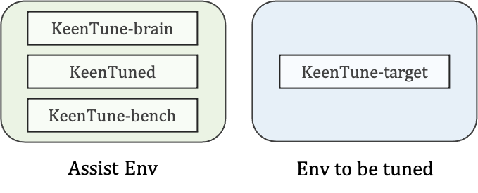
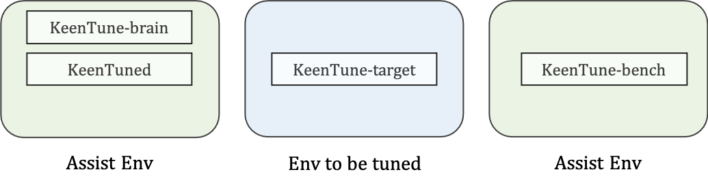
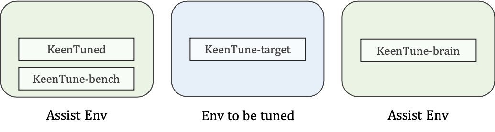
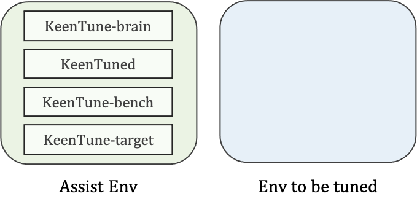

# Deployment of KeenTune

## Topology of KeenTune Deployment
根据不同的任务需求，KeenTune可以有多种灵活的部署形式，并通过[配置文件](./Configuration_cn.md)实现各组件的通信  
+ 常规的KeenTune拓扑如图所示，我们将KeenTune-target部署在待调优环境中，其他组件部署在辅助环境中    
  
+ 如果**benchmark工具所需的计算资源较高**，我们可以将keentune-bench单独部署在一个辅助环境中，有利用提高工作负载的压力  
  
+ 如果我们使用的**调优算法所需要的计算资源较高**，我可以将keentune-brain单独部署在一个辅助环境中，提高算法效率
  
+ 在**智能控压**的应用场景下，我们需要将keentune-bench和keentune-target部署在同一个环境中。  
  

## YUM Installation
参考[《KeenTune依赖文档》](./Dependencies_cn.md)配置yum源，然后使用以下命令安装KeenTune各组件
```s
#yum源安装keentune各组件
yum install keentuned keentune-brain keentune-bench keentune-target
```

## Source installation
yum源里的KeenTune可能不是最新版本，我们还可以选择下载KeenTune的最新代码并编译安装
1. 首先下载KeenTune的源码包  
```s
git clone https://gitee.com/anolis/keentuned.git
git clone https://gitee.com/anolis/keentune_brain.git
git clone https://gitee.com/anolis/keentune_target.git
git clone https://gitee.com/anolis/keentune_bench.git
```
2. 参考[《KeenTune依赖文档》](./Dependencies_cn.md)准备KeenTune的安装依赖
3. 编译安装各组件
```s
# KeenTuned
cd keentuned
./keentuned_install.sh

# KeenTune-brain
cd keentune_brain
sudo python3 setup.py install

# KeenTune-target
cd keentune_target
sudo python3 setup.py install

# KeenTune-bench
cd keentune_bench
sudo python3 setup.py install
```

## Running
### 使用systemctl运行KeenTune
1. 参考[《KeenTune配置文档》](./Configuration_cn.md) 编辑KeenTune各组件的配置文件
2. 使用以下命令启动KeenTune各组件
```s
systemctl start keentuned       # 启动keentuned服务
systemctl start keentune-brain  # 启动keentune-brain服务
systemctl start keentune-bench  # 启动keentune-bench服务
systemctl start keentune-target # 启动keentune-target服务
```

### 使用Tmux运行KeenTune
1. 参考[《KeenTune配置文档》](./Configuration_cn.md) 编辑KeenTune各组件的配置文件
2. 安装和运行tmux `yum install tmux && tmux`
3. 在tmux的session中直接运行keentune各组件
```s
keentuned       # window1 in tmux
keentune-brain  # window2 in tmux
keentune-bench  # window3 in tmux
keentune-target # window4 in tmux
```